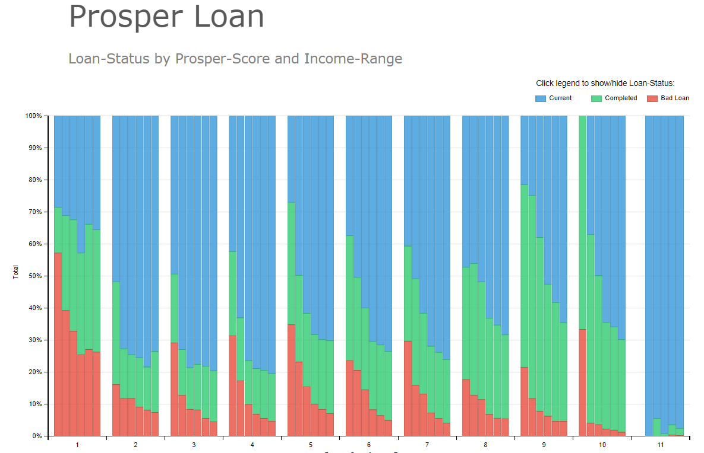

# P6 - Data Visualization
## Prospect Loan data visualization
**Udacity Data Analyst NanoDegree Project6 submission**

#### Summary
This Project creates chart showing % of loan-status values by their Prosper score and income range values. 
It uses dimple.js for creating the main chart, and also uses D3 to set overall attributes.  This chart has interactive legend, which can be used to filter out loan-status values.

Here is the screenshot of the viz:

#### Design

I used the templates available in dimplejs.org website, and well as the course to get design ideas. I decided to go for 100% stacked column-chart, showing the % of measure in each column that adds up to 100%. I wanted to show what % of loan-types contributes to the whole. 

From the feedback that I collected below, I performed following improvements:
* The values for Prospect-Score, Income-Range and Loan Status were not sorted. So I sorted them in the script.
* The default colors for loan-type was not intuitive. So, I manually assigned appropriate colors to each value.
*  There was no interactivity in the plot. So, I added a feature to filter the loan-type values from the legend.

#### Feedback
Following are the feedback I collected from 3 individuals:
 * **Person 1:** 
 	1) Income Range values are not ordered (from lower to higher income), so it is difficult to follow loan-status values based on income.
    2) Bad Loan has green color and Completed loan has red color, which is exactly opposite of what it should be. Most peoplke associate Red with 'Bad', and green with 'Good'.
    
* **Person 2:**
	1) Should add some kind of header, and descriptive sub-header, as well as legend title.
    2) Will be nice if user can play around with different filters.
    
* **Person 3:**
	1) The x-axis is confusing. It has two dimensions (Prosper-Score and Income-Range), however, only values for Prosper Score is labeled in the axis (1-11). Values for Income Range is not labeled, so it is hard to associate a bar with an Income Range. 
    

#### Resources

[Bar Labels](http://dimplejs.org/advanced_examples_viewer.html?id=advanced_bar_labels)

[Interactive Legend](http://dimplejs.org/advanced_examples_viewer.html?id=advanced_interactive_legends)

[Udacity Data-Analyst Nanodegree - Data Visualizations](https://classroom.udacity.com/nanodegrees/nd002/parts/00213454010)

[Let's Make a Bar Chart](https://bost.ocks.org/mike/bar/3/)

[dimple documentation](https://github.com/PMSI-AlignAlytics/dimple/wiki)

 